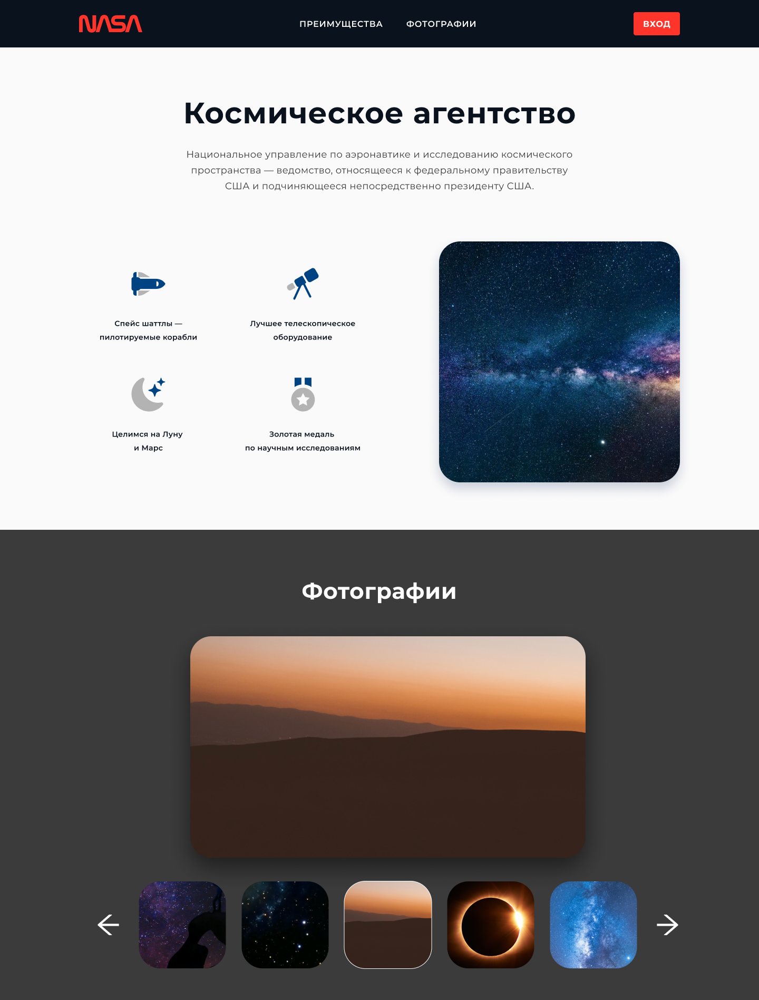
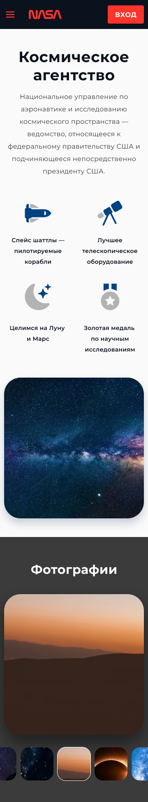

# Задание
Необходимо собрать с помощью bootstrap 5 и запустить новую страницу по макету 
https://www.figma.com/file/csU67B0SQVZO1AkwvMZa3D/Тестовое-задание-N2?type=design&node-id=1-1012&mode=design&t=wz2qpqpXo6RochwT-0
- сборку проекта осуществить с помощью python 3.9, Django 4.1 и MySQL
- проект разместить в git репозитории
- для сборки клиентской части страницы необходимо использовать bootstrap 5
- для запуска слайдера необходимо использовать slick slider http://kenwheeler.github.io/slick/ (см. Slider Syncing)
- по клику на большую фотографию на слайдере фотки должны открываться на весь экран и листаться галереей
- необходимо чтобы slider заполнялся через админку django. Необходимо настроить визуально понятный admin.py, чтобы выводилась картинка и название в списке записей элементов слайдера.
- для картинок модели слайдера необходимо использовать пакет django-filer и через него грузить картинки в слайдер
- для кадрирования картинок в админке и на клиентской стороне использовать easythumbnails
- записи слайдера в админке должны сортироваться при помощи drag&drop, для этого необходимо использовать пакет django-admin-sortable2
- все зависимости для запуска проекта расположить в файле req.pip в корне проекта. 


Тестовое задание проверяет поверхностно основные навыки кандидата необходимые для текущей вакансии:
- умение работать с bootstrap 5;
- базовые знания HTML, CSS, JavaScript;
- умение запустить и собрать новый проект на Django, с подключением дополнительных пакетов;
- базовые навыки работы с GIT;
- базовые навыки работы с Figma.

## Запуск:
- запустить сервер MySQL 
- указать настройки подключения к БД в параметре DATABASES файла setting.py 
- из папки проекта:
    - применить миграции ```python manage.py migrate```
    - создать суперпользователя ```python manage.py createsuperuser```
    - запустить сервер ```python manage.py runserver```

## Внешний вид:

